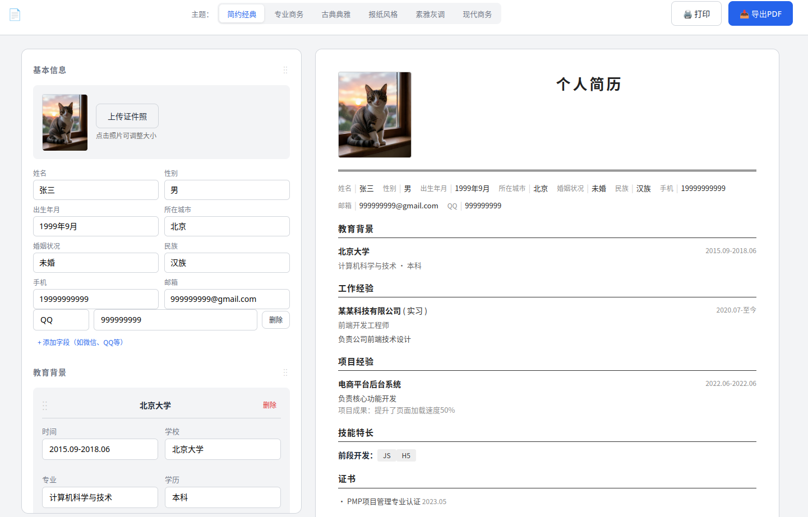

# 简历生成器

一个纯前端的在线简历制作工具，无需登录、无需联网，开箱即用。

## 预览  
[https://n0nsense11.github.io/resume.html](https://n0nsense11.github.io/resume.html)  

## 功能特性

### 编辑功能
- **基本信息**：姓名、性别、出生年月、所在城市、婚姻状况、民族、手机、邮箱，支持添加自定义字段
- **证件照**：上传照片，可拖动调整预览区照片大小
- **教育背景 / 工作经验 / 项目经验 / 技能特长 / 证书**：可自由添加、编辑、删除条目
- **自我评价 / 自定义内容**
- **拖拽排序**：编辑区的各个区块可拖动调整显示顺序
- **实时预览**：左侧编辑、右侧即时看到效果
- **本地存储**：刷新页面数据不丢失

### 输出
- **打印**：直接 `Ctrl+P` 打印
- **导出 PDF**：点击「导出 PDF」按钮，调用浏览器打印对话框保存为 PDF

---

## 主题风格

六种预设主题，全部低饱和度配色，适合正式场合：

| 主题 | 风格描述 |
|------|----------|
| 简约经典 | 黑色线条分隔，朴素黑白，适合任何行业 |
| 专业商务 | 蓝色系 + 左侧边条强调，IT/商务场景首选 |
| 古典典雅 | Georgia 衬线字体，棕色系，编辑出版风格 |
| 报纸风格 | Times New Roman 字体，横线分隔，经典编辑风格 |
| 素雅灰调 | 超级克制的浅灰，几乎无装饰，沉稳低调 |
| 现代商务 | 深灰 + 浅灰底色，圆角元素，年轻职场人适用 |

---

## 打印 / 导出 PDF

1. 点击右上角「**📥 导出PDF**」按钮
2. 在打印对话框中，选择「**另存为 PDF**」作为目标打印机
3. 取消勾选“页眉和页脚”及“背景”

---

## 技术说明

- **零依赖**：单文件 HTML，无 npm、无框架、无构建步骤
- **响应式**：支持 1050px 以下宽度自动切换为单栏布局
- **照片处理**：使用 FileReader API，照片以 Base64 形式存储，不上传到任何服务器
- **数据持久化**：使用 localStorage 保存填写内容（自动完成，刷新不丢失）
- **主题切换**：纯 CSS 类名切换，切换主题实时生效

